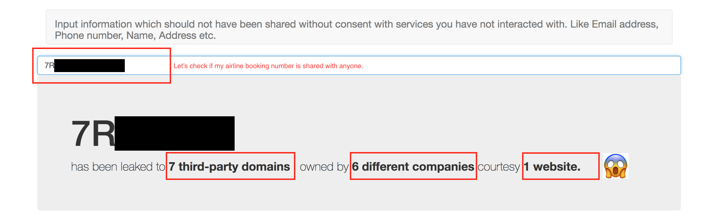
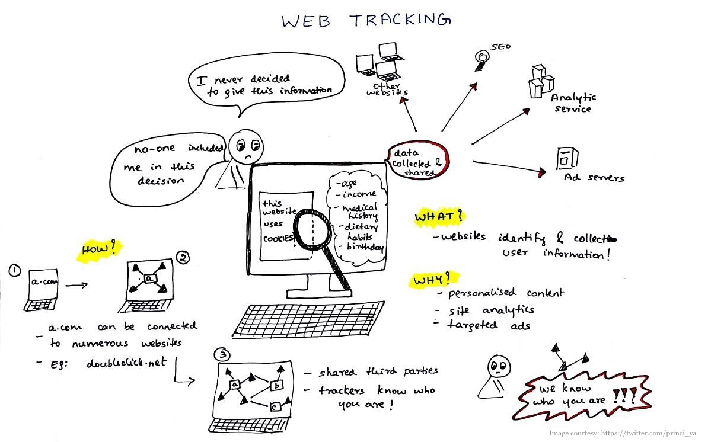
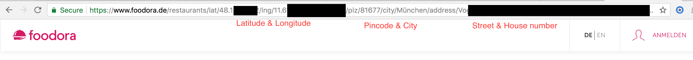
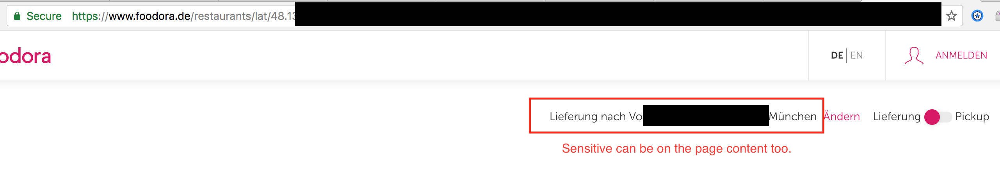
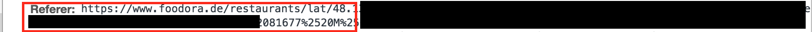
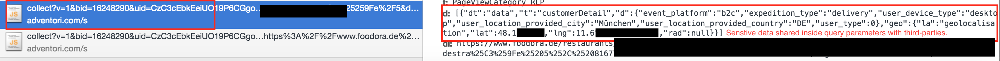
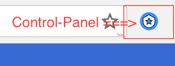
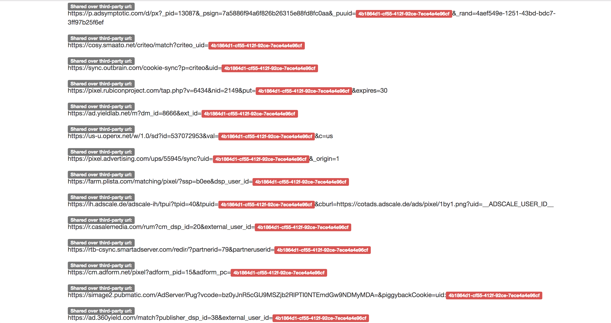

 
# Local-sheriff

[](https://www.defcon.org/html/defcon-26/dc-26-demolabs.html)

Think of Local sheriff as a reconnaissance tool in your browser.
While you normally browse the internet it works in the background and helps you to identify what sensitive information(PII) about you is being shared / leaked to which all third-parties.

Local Sheriff is a web-extension that can be used with Chrome, Opera, Firefox. Usage section has more details.

 

## Motivation:
 

It has become a norm for websites to load enormous amounts of third-party resources on their webpages. While the websites have genuine use cases like analytics, measure app performance, audience measurements, goal conversions, content recommendation, social sharing , CDNs etc.

But the way these third-parties are implemented & used by websites they are often not privacy proof.
Sensitive user information like passwords, email-ids, name, order IDs, date-of-birth and other PII is leaked in abundance to whole bunch of third-parties.

 

**The issues that Local Sheriff aims to highlight:**
1. Was the user aware and gave consent to share this sensitive information with this these parties?
2. Why do these third parties need to receive this information?
3. Is website owner even aware that sensitive user information is being leaked to these third parties?
4. Who are these third parties?
5. What can they doing with user information?

## How Local Sheriff identifies leaks:

### While you are interacting with the webpages, the PII could be:

**1.	In the URL (Eg: booking reference, Lastname, email, twitter handle etc.)**

   

**2.	On page content (Eg: capability URLs, which contain sensitive information but are not behind log in)**

   

**3.	The values entered in forms**

### These URL’s can be shared with the third-parties:

**1.	Via HTTP Headers like Referrer**

   

**2.	Via query parameters**
 
   

**3.	Browser features like Chrome browser – Translate and more.**

### After you install Local Sheriff it starts to observes browser network traffic silently for the following:
1. Web pages (First party) loading third-party resources.
2. URLs being leaked by a first-party to third-party. Via HTTP header like Referrer and/or via query parameters third-parties.
3. Data being sent to third-parties in GET request & POST request.
4. Information being entered in forms.
5. As soons as Local Sheriff detects that a URL has been shared with a third-party, it issues an anonymous `GET` request to that page again to simulate what information can be accessed only based on the URL without user-cookies, session etc.
6. HTML content of page fetched after step-5 is also saved for inspection.

### The user can at any time visit the control-panel page by clicking the icon in the address bar:


1.	Lists if any of the information entered in the input fields is shared with the third-parties.
2.	User can query text, cookie values etc and it will list down: Which websites leaked this query to how many third-parties and who they belong to.



 **DEMO:** [Example of how information entered in forms can be leaked.](https://streamable.com/yl3qq)

## Data Sources:

Local Sheriff uses the open-source tracker database from [WhoTracks.me](https://whotracks.me/) for creating tracker hostname to company mapping.Right now it is packaged in the extension itself.

Eg: Given a tracker hostname: `atlassbx.com` find the company who owns it: `Facebook`.

## Usage:
```
git clone https://github.com/cliqz-oss/local-sheriff.git

Chrome:
1. Open chrome://extensions
2. Enable developer mode
3. Load unpacked extension & point to the folder local-sheriff

Firefox:
1. open about:debugging
2. Load temporary-addon
3. Point to the folder local-sheriff and select manifest.json.

Please note Firefox will remove the extension on restart.
```

Alternatively:
- You can install from Chrome store : [Local Sheriff](https://chrome.google.com/webstore/detail/local-sheriff/ckmkiloofgfalfdhcfdllaaacpjjejeg)

Once you have it running, visit different pages like:

- Check some e-commerce order status
- Fill some forms
- Try reset password

Check the control center to see what information has been shared.

Please note:

- Local Sheriff will not work optimally if you have some tools like ad-blocking, Ghostery, privacy-badger installed.

## Examples of data leaks:
- [Emirates](https://medium.freecodecamp.org/how-airlines-dont-care-about-your-privacy-case-study-emirates-com-6271b3b8474b)
- [HackerOne](https://twitter.com/konarkmodi/status/978640867627098118) :[Video](https://streamable.com/yl3qq)
- [Shadow profile: Can Facebook track you if even you have never visited it?](https://streamable.com/yzgz5)
- Spotify leaks & fixes.
- Lufthansa
- GA-DoubleClick Cookie sync
- Criteo Cookie sync
- Foodora

## App store links:
- Chrome store - [Local Sheriff](https://chrome.google.com/webstore/detail/local-sheriff/ckmkiloofgfalfdhcfdllaaacpjjejeg)

## Contributing

Thanks for your interest in contributing to *Local Sheriff*! There are many ways to contribute. To get started, take a look at [CONTRIBUTING.md](CONTRIBUTING.md).

## Roadmap:

1. Clean data on stored on disk on clear history signal.
2. Adopt build infra. for extensions.
3. Automatically notify user on form data being shared with third-parties.
4. Use more data sources like Headers, Cookies, POST request content, data being sent as Base64 payload.
5. Ability for the users to see which third-parties can track them across them across web and also de-anonymize them.
6. HAR support: Make core API which stores data and provides search interface generic so that this tool can be used outside the browser to inspect traffic outside of browser.

## PRIVACY & SECURITY

- Local Sheriff does not transmit any data over the internet. All data needed for analysis remains on your local hard disk drive at all times. However, the data saved by this extension is NOT encrypted, so any data you save remains in the clear, although it will remain on your hard drive and only someone who knows where to look and has physical access to your hard drive would be able to access it. There is a plan in the roadmap to delete the data when user clears history.

- Extensions in Chrome by default do not work in incognito mode. While, in Firefox they are enabled with limited functionailty. It would worth checking and deciding what should be the desired behaviour.

## Contributors:

Thanks to [@solso](https://twitter.com/solso) [@Pythux](https://twitter.com/Pythux) [@ecnmst](https://github.com/ecnmst) for their valuable inputs and being early adopters of this tool.

#### Lead Developer:

Konark Modi: [@konarkmodi](https://twitter.com/konarkmodi)

#### Coverage:

- [Threatpost](https://threatpost.com/def-con-2018-telltale-urls-leak-pii-to-dozens-of-third-parties/134960/)
