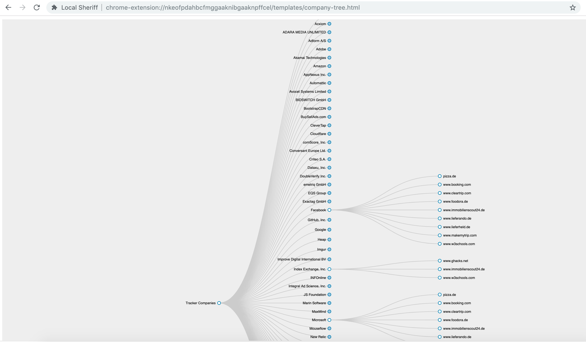

1.	Local-Sheriff now also works with Firefox based browsers. 
  - Unlike last year, when it was only supporting Chromium based browsers.
  - Which also means it can be used on Chrome, Opera, Firefox, Cliqz, Brave.
  
2.	Maintenance efforts:
  - Update tracker database from WhoTracks.me
  - Keeping up with WebRequest API changes with chrome release 72.
    - Chrome release 72 introduced some breaking changes, which meant Local-Sheriff could not capture HTTP headers. 
3.	Two new features:
    1. Potential Identifiers tracking users' across websites:
      - Based on the data sent out via cookies and query parameters. Local sheriff can now heuristically list the data points that can be used to track the users' movement across multiple websites.
      - Now when the user opens Local-Sheriff control-panel, there are multiple sections:
        a. Data entered in forms being shared with third-parties.
        b. Values Local-sheriff detects are being used as tracking identifiers.
        c. Company wise profile
        
        To check what values are being used to track the user, simply click the option "Click to check: Datapoints that are being used to track me across domains? ".
        
        This is will list the values that can be used for tracking you.
        [Identifiers that can track you](docs/images/tracking_a.png)
        
        Once you click the value, it will share which tracker uses's this value and which all websites can that track.
        [Detailed logs of how where they can track you](docs/images/trackiing_id_1.png)
        
        
    2. Company wise profile.
      - Another feature that Local Sheriff provides now is to let users' know which tracker company knows which all websites you have visited.
      - Clicking the option: "Click to check: Which companies can track me on the internet?" opens a new tab with a collapsable tree, listing all the organizations that know something about you. 
      - Once you click on the individual company it shows which domains it knows you visited.
      
      
